# When moment summaries can certify attention

**Boundary certificates, value-aware bounds, and GH200 evidence.**

Sam Mausberg

Research manuscript, version 0.2.0. September 5, 2026.

## Abstract

Moment summaries can avoid a token scan when their remaining uncertainty cannot
change the consumer's observation. We characterize this condition exactly for
independent block intervals, construct exponential-attention enclosures from
projected signed moments, and strengthen them with the dependence between block
mass and value range. A Lean development proves the real-arithmetic chain from
concrete finite block witnesses to an observation cell; all 64 theorems build
and pass an axiom audit. An exact-rational study finds 61 of 149 initial
coordinates certifiable with value coupling versus 57 with boxes, including a
controlled example that defeats a global value-range baseline. GH200 experiments
explain why reducing arithmetic alone is insufficient: parallel block reduction
improves a favorable resident screening stage from 118.65 to 20.09 microseconds,
but its complete host-decision path takes 83.11 microseconds against a 35.62
microsecond fused dense baseline. Actual post-RoPE traces from Qwen2.5-0.5B
produce no whole-output passes in 2,016 rank-eight head instances; discarded
scores dominate, while full-rank checks expose exponential remainder growth.
The resulting contribution is a proved certificate interface and an empirical
account of its information and execution bottlenecks.

**Artifact and claim scope.** The machine-checked result concerns real attention
under explicit centering, radius, symmetry, and row-sum witnesses. The rational
executable and its polygon optimizer are independently tested implementations;
they are not extracted from Lean. The directed CUDA checker consumes outward
imported rational boxes. The fast NumPy/CUDA summary path supplies numerical
screens, whose floating-point soundness is not proved. Exact-real rounding also
has a different contract from a particular fused GPU kernel. The
[formalization map](../docs/FORMALIZATION.md),
[execution specification](../docs/GH200.md), and
[recorded artifacts](../results/README.md) give the precise boundaries.

## Research questions

We ask what information a summary must retain to decide an observation, which
term prevents that decision, and when avoided token reads repay construction
and screening. These questions motivate three distinct comparisons: boxes
against coupled metadata, analytic uncertainty against actual score variation,
and an optimized resident kernel against its complete execution path. The
negative cases determine the method's useful scope as directly as the positive
examples.

## 1. Definitions and the observation contract

Let the visible input be a finite, nonempty set partitioned into nonempty blocks
$b=1,\ldots,B$. Write a positive normalized reduction as

$$
y_j=\frac{N_j}{Z},\qquad Z=\sum_b z_b>0,\qquad N_j=\sum_b n_{bj}.
$$

For a fixed block center $\nu_{bj}$, define the *centered numerator*

$$
m_{bj}=n_{bj}-\nu_{bj}z_b.
$$

Suppose metadata establishes sound intervals

$$0\leq l_b\leq z_b\leq u_b,
\qquad m^-_{bj}\leq m_{bj}\leq m^+_{bj}.$$

All intervals refer to the same input, mask, query, scaling, and version of the
underlying data. Positivity of $Z$ is a separate premise. In executable checks,
$\sum_b l_b>0$ is a sufficient way to discharge it.

An observation cell $(a_j,b_j)$ is an open interval on which the consumer is
constant. For finite numerical BF16 rounding, one may choose the midpoints to
the preceding and following representable values. Strict inequalities avoid
tie-breaking ambiguity. This formulation models numerical values, not the
bitwise distinction between positive and negative zero.

**Lemma 1 (constant consumer).** If $y\in S$ and $C(x)=c$ for every $x\in S$,
then $C(y)=c$.

*Proof.* Substitute $y$ in the premise. For monotone rounding, an alternative
closed-interval test is $Q(l)=Q(u)$ with $l\leq y\leq u$; monotonicity gives
$Q(l)\leq Q(y)\leq Q(u)$. $\square$

Lean source: `constant_consumer`, `monotone_rounding`. A concrete IEEE-754 model
and its monotonicity theorem are not supplied.

## 2. Exact residual certificates over block boxes

At a boundary $c$, define

$$
\begin{aligned}
\mathcal L_j(c)&=\sum_b\left[m^-_{bj}+
\min\{(\nu_{bj}-c)l_b,(\nu_{bj}-c)u_b\}\right],\\
\mathcal U_j(c)&=\sum_b\left[m^+_{bj}+
\max\{(\nu_{bj}-c)l_b,(\nu_{bj}-c)u_b\}\right].
\end{aligned}
$$

**Theorem 2 (boundary certificate).** Under the interval and positivity premises,

$$
\mathcal L_j(c)\leq N_j-cZ\leq\mathcal U_j(c).
$$

Consequently,

$$\boxed{\mathcal L_j(a_j)>0\quad\text{and}\quad
\mathcal U_j(b_j)<0\quad\Longrightarrow\quad a_j<y_j<b_j.}$$

*Proof.* The exact residual identity is

$$
N_j-cZ=\sum_b\{m_{bj}+(\nu_{bj}-c)z_b\}.
$$

For a fixed scalar $\alpha$, the extrema of $\alpha z$ on $[l,u]$ are
$\min(\alpha l,\alpha u)$ and $\max(\alpha l,\alpha u)$. Apply this identity
with $\alpha=\nu_{bj}-c$, add the centered-numerator bounds, and sum. Dividing
the first strict sign inequality by the positive $Z$ gives $a_j<y_j$; the other
gives $y_j<b_j$. $\square$

Lean source: `mul_enclosure`, `residual_identity`, `residual_enclosure`,
`observation_cell`.

This test does not divide to evaluate the certificate. A numerical division may
still be used to choose a candidate cell. A poor candidate cannot invalidate a
sound certificate: it only makes certification less likely.

**Theorem 3 (optimality for the stated metadata).** Treat the block intervals as
an independent Cartesian product, with no extra coupling constraints. For every
fixed $c$, $\mathcal L_j(c)$ and $\mathcal U_j(c)$ are the attained minimum and
maximum of the residual over that product.

*Proof.* For the minimum, choose $m_{bj}=m^-_{bj}$ and choose $z_b=l_b$ when
$\nu_{bj}-c\geq0$, otherwise $z_b=u_b$. These choices are simultaneous,
admissible vertices of the product box and make every summand its minimum. The
opposite choices and $m_{bj}=m^+_{bj}$ attain the maximum. Theorem 2 supplies the
matching inequalities. $\square$

Lean source: `lowerChoice_mem`, `upperChoice_mem`, `lowerChoice_attains`,
`upperChoice_attains`, `lower_attained`, `upper_attained`.

This is not a universal optimality claim about attention algorithms. Actual
block masses and centered numerators can be correlated; the product box forgets
that information. Richer metadata may give tighter bounds. The two extrema need
not be attained by the same input. If the extremizers are interpreted as
normalized outputs rather than residuals, require $\sum_b l_b>0$ so that
all vertices have positive denominator. Residual-box optimality itself does
not need that additional condition.

**Example.** Take two blocks with centers $0,2$, masses in $[1,2]$, and centered
numerators identically zero. The true output range is $[2/3,4/3]$. The boundary
certificate proves membership in $(0.6,1.4)$. A symmetric residual bound around
$1$, using midpoint masses, yields radius $0.5$ and does not prove this cell.
This establishes a strict improvement for this example, not domination of
every possible earlier correlated certificate.

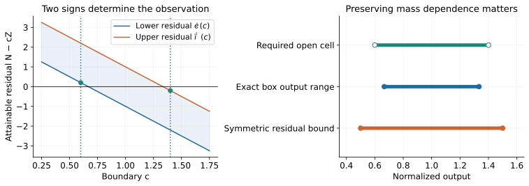

*Figure 1. An analytic two-block example. The signs at 0.6 and 1.4 prove the
required open cell. The output range is closed because its extrema are attained;
the illustrative cell is not a BF16 rounding cell.*

**Corollary 3.1 (when the metadata is sufficient).** If $\sum_b l_b>0$, every
output compatible with the independent block box lies in $(a_j,b_j)$ if and
only if $\mathcal L_j(a_j)>0$ and $\mathcal U_j(b_j)<0$.

*Proof.* Sufficiency is Theorem 2. If the lower sign test fails, Theorem 3
supplies a box vertex whose residual at $a_j$ is nonpositive. Its denominator
is positive, so its normalized output is at most $a_j$. The upper extremizer
gives the corresponding counterexample at $b_j$. $\square$

Lean: `observation_cell_iff`. This converse explains a rejection precisely:
the box metadata admits a conflicting output. It does not say that this
conflicting vertex is realizable by the original tokens. Improving acceptance
therefore requires tighter intervals, additional dependence information, or a
different observation contract.

## 3. Monotone local refinement

**Theorem 4 (refinement).** Replace each mass interval by a nonempty subinterval
and each centered-numerator interval by a nonempty subinterval. For every fixed
boundary $c$, $\mathcal L_j(c)$ cannot decrease and $\mathcal U_j(c)$ cannot
increase. If both the old and new enclosures contain the truth, their
intersection does too.

*Proof.* A minimum over a smaller set cannot be smaller; a maximum cannot be
larger. Equivalently, apply the endpoint multiplication bounds to both new
endpoints, then sum. Intersection contains any point common to its two
operands. $\square$

Lean source: `term_refinement`, `residual_refinement`, `interval_intersection`.

A scheduler may therefore refine selected blocks rather than discard all
summary work when one test fails. The invariant is sound enclosure, not the
particular choice of priority. The implementation's uncertainty priority is a
heuristic, not an optimal scheduling theorem. Monotonicity concerns a fixed
cell; changing the candidate cell changes the question being tested.

No unconditional termination with an open-cell certificate is asserted. A true
output at a rounding midpoint may remain ambiguous forever under interval
refinement. A complete executor needs a tie-aware path or a declared reference
fallback, and a cap on refinement work.

### 3.1 Preserving mass and value dependence

For a block/channel, retain the exact centered value extrema
$p_{bj}=\min_i(v_{ij}-\nu_{bj})$ and
$q_{bj}=\max_i(v_{ij}-\nu_{bj})$. Positive weights imply

$$
p_{bj}z_b\leq m_{bj}\leq q_{bj}z_b.
$$

This follows by multiplying each centered-value inequality by its nonnegative
weight and summing. Lean proves this step as `centered_value_mass_coupling`.
It retains dependence that a separate mass/numerator box discards.

Define the nonempty compact polygon

$$
P_{bj}=\{(z,m):l_b\leq z\leq u_b,\quad
m^-_{bj}\leq m\leq m^+_{bj},\quad p_{bj}z\leq m\leq q_{bj}z\}.
$$

**Theorem 4.1 (coupled certificate).** Replace each block summand in
$\mathcal L_j(c)$ by $\min_{(z,m)\in P_{bj}}[m+(\nu_{bj}-c)z]$, and each
summand in $\mathcal U_j(c)$ by the corresponding maximum. The resulting
certificate is sound, never wider than the box certificate, and improves
monotonically under sound box intersection with fixed value extrema.

*Proof.* The true mass and centered numerator belong to $P_{bj}$. The residual
identity from Theorem 2 still holds. Each polygon is contained in its original
rectangle, so its minimum cannot be smaller and its maximum cannot be larger.
Shrinking the rectangle shrinks its intersection with the fixed cone.
Summing and dividing by the positive total mass proves the claim. $\square$

The rational implementation evaluates this support exactly. A linear function
on a nonempty compact polygon reaches its extrema at vertices. Candidate mass
coordinates are $l_b,u_b$ and $m^-_{bj}/s,m^+_{bj}/s$ for each nonzero slope
$s\in\{p_{bj},q_{bj}\}$. At a feasible candidate $z$, the centered endpoints
are $\max(m^-_{bj},p_{bj}z)$ and $\min(m^+_{bj},q_{bj}z)$. These include all
vertices: they are intersections of vertical, horizontal, or sloping boundary
lines. The two sloping lines meet at $z=0$, which, if feasible for nonnegative
mass, is a mass endpoint. Coincident lines and degenerate segments need no
additional candidates. Inconsistent metadata produces an empty candidate set
and is rejected. This finite algorithm has a constant number of rational
operations per block/channel; its bit cost depends on the fractions.

Joint optimization can outperform intersecting two independently computed
scalar residual bounds. With $z\in[1,4]$, $m\in[1/2,3/2]$,
$-z/2\leq m\leq z/2$, and objective $m-z/4$, the box gives $[-1/2,5/4]$
and the cone with the mass interval gives $[-3,1]$. Their scalar intersection
is $[-1/2,1]$; joint optimization gives $[-1/2,3/4]$. This is a metadata
geometry example, not an assertion that every vertex is a token realization.

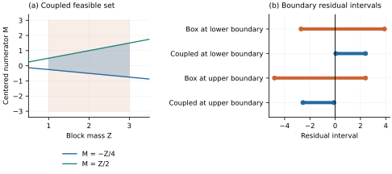

*Figure 2. A second analytic example shows how value dependence excludes the
box corners that prevent both signs. The required interval is illustrative.*

The Lean library proves the positive-weight coupling and the box certificate.
The polygon support algorithm is supported by the argument above and independent
exact geometry tests; its executable correctness is not formalized.

### 3.2 A quantitative condition for refinement

At a fixed boundary $c$, the width of the box residual is

$$
W_j(c)=\mathcal U_j(c)-\mathcal L_j(c)
=\sum_b\bigl[m^+_{bj}-m^-_{bj}
 +|\nu_{bj}-c|(u_b-l_b)\bigr].
$$

**Proposition 4.2 (margin versus uncertainty).** For the true output inside
$(a_j,b_j)$, it suffices that
$W_j(a_j)<Z(y_j-a_j)$ and $W_j(b_j)<Z(b_j-y_j)$.

*Proof.* At the lower boundary the true residual is $Z(y_j-a_j)>0$. Since it
lies in $[\mathcal L_j,\mathcal U_j]$, the lower endpoint is at least the true
residual minus $W_j$. The upper-boundary argument is symmetric. $\square$

This is an explanatory sufficient condition, not an executable rule requiring
knowledge of the true output. It shows why near-midpoint coordinates are hard,
why refining the block with the largest residual width is sensible, and why
smaller numerical error alone does not establish a rounding decision. If sound
refinement widths converge to zero and the true output has positive distance
from both boundaries, a fixed cell eventually passes. The present bounded
executor does not assume that this convergence occurs before fallback.

## 4. Projected signed-moment attention enclosures

### 4.1 Stored quantities

Attention is

$$
y_j(q)=\frac{\sum_i e^{q^Tk_i}v_{ij}}{\sum_i e^{q^Tk_i}}.
$$

The query already includes attention scaling. Keys are those actually attended
to after positional transformations. Let $\mu_b,\nu_b$ be exact block means,
$\delta_i=k_i-\mu_b$, and $x_i=v_i-\nu_b$.

Select $r\leq d$ coordinates. The implementation uses a coordinate prefix;
permutation can express another fixed subset. It does not silently substitute
an approximate PCA basis. Split

$$q^T\delta_i=t_i+e_i,
\quad t_i=u^T\delta_i^{(r)},
\quad |t_i|\leq\rho_b,
\quad |e_i|\leq\epsilon_b.$$

Store coordinate radii $a_{bk}\geq\max_{i\in b}|\delta_{ik}|$ and value radii
$R_{bj}\geq\max_{i\in b}|x_{ij}|$. Valid query bounds are

$$\rho_b=\sum_{k<r}|q_k|a_{bk},
\qquad\epsilon_b=\sum_{k\geq r}|q_k|a_{bk}.$$

Store

$$\Sigma_b=\operatorname{mean}(\delta^{(r)}\delta^{(r)T}),
\quad C_b=\operatorname{mean}(\delta^{(r)}x^T),
\quad H_{bj}=\operatorname{mean}(\delta^{(r)}\delta^{(r)T}x_j).$$

The full $H$ tensor is temporary construction data, not query metadata. Retain
its diagonal $D_{bj}$ and a scalar witness

$$
\eta_{bj}\geq\max_a\sum_k |(H_{bj}-D_{bj})_{ak}|.
$$

Here $D_{bj}$ denotes the diagonal matrix or its stored diagonal as appropriate.
The choice $D=0$ is also valid. Removing the diagonal weakly reduces the stored
absolute row-sum witness, but also shifts the approximation center. The resulting
intervals need not be nested, so acceptance need not improve for every cell.
For example, take $H_{11}=9$, $H_{23}=H_{32}=10$, all other entries zero, and
$u=(1,0,0)$. Both row-sum witnesses equal 10. The quadratic enclosure changes
from $[-10,10]$ to $9+[-10,10]$. The implementation exposes both representations.
For $r=0$, define the empty row-sum witness to be zero.

**Lemma 5 (quadratic witness).** If $F$ is symmetric and
$\eta\geq\max_a\sum_k|F_{ak}|$, then

$$
|u^TFu|\leq\eta\|u\|_2^2.
$$

*Proof.* Use $|u_a u_k|\leq(u_a^2+u_k^2)/2$. Symmetry makes the row and column
contributions equal, hence

$$|u^TFu|\leq\tfrac12\sum_{a,k}|F_{ak}|(u_a^2+u_k^2)
=\sum_a u_a^2\sum_k|F_{ak}|\leq\eta\sum_a u_a^2.\quad\square$$

This proof avoids numerical eigenvalue computations. Lean proves it as
`quadratic_rowsum_bound`; `signed_moment_omission_bound` instantiates it on the
actual finite signed tensor and its retained symmetric part.

### 4.2 A sharper Taylor majorant

Define

$$\kappa(\rho)=
\begin{cases}
(e^\rho-1-\rho-\rho^2/2)/\rho^2,&\rho>0,\\
0,&\rho=0.
\end{cases}$$

**Lemma 6 (second-order exponential remainder).** For $\rho\geq0$ and
$|t|\leq\rho$,

$$|e^t-1-t-t^2/2|\leq\kappa(\rho)t^2,
\qquad\kappa(\rho)\leq e^\rho\rho/6.$$

The latter inequality is strict for $\rho>0$. For positive radius, the first
coefficient is the smallest uniform quadratic majorant on this interval:
$t=\rho$ attains equality. At $\rho=0$ we choose the nonnegative coefficient
zero; minimality over arbitrary real coefficients is not asserted.

*Proof.* At $\rho=0$, $t=0$. Otherwise absolute convergence of the exponential
series gives

$$\left|\sum_{n\geq3}\frac{t^n}{n!}\right|
\leq t^2\sum_{n\geq3}\frac{\rho^{n-2}}{n!}
=\kappa(\rho)t^2.$$

Writing $n=m+3$ and using $(m+3)!\geq6m!$ yields the second inequality by
termwise comparison with $(\rho/6)e^\rho$. For $m\geq1$ the factorial inequality
is strict and $\rho^{m+1}>0$. $\square$

The exact-real inequality is sharper than the earlier Lagrange bound. Near zero,
the implementation evaluates a series rather than subtracting nearly equal
floating values. That implementation is numerical unless an outward remainder
is included. The rational path uses an upper enclosure of $e^\rho$.

Lean derives the analytic bound from the convergent `Real.exp` series in
`exp_remainder_sharp`. `exp_remainder_endpoint`, `exp_coefficient_optimal`, and
`exp_coefficient_lt_lagrange` establish endpoint attainment, optimality, and
strict improvement. The conditional lifting lemma is then used with its
remainder premise discharged by the analytic theorem.

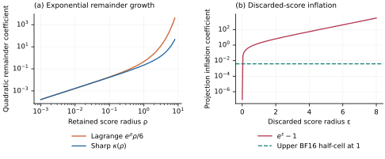

*Figure 3. The sharper coefficient improves constants substantially at large
radius, but still grows exponentially. Projection has a separate exponential
cost. The BF16 line is a unit-scale guide rather than a sufficient certificate.*

### 4.3 The enclosure theorem

Fix any common finite shift $s$ and define the actual block quantities by

$$
z_b(s)=\sum_{i\in b}e^{q^Tk_i-s},\qquad
m_{bj}(s)=\sum_{i\in b}e^{q^Tk_i-s}x_{ij}.
$$

The common factor $e^{-s}$ cancels from the normalized output. All subsequent
endpoints and residuals refer to these shifted quantities. Set
$a_b=q^T\mu_b$, $w_b=n_b e^{a_b-s}$, and

$$\sigma_b^2=u^T\Sigma_bu,\qquad
A_b=1+\sigma_b^2/2,\qquad\tau_b=\kappa(\rho_b)\sigma_b^2.$$

For the projected scores, define

$$
\begin{aligned}
\widetilde l_b&=w_b\max\{1,A_b-\tau_b\},&
\widetilde u_b&=w_b(A_b+\tau_b),\\
\widehat m_{bj}&=w_b\left[(C_b^Tu)_j+\tfrac12 u^TD_{bj}u\right],&
\beta_{bj}&=w_b\left[\tfrac12\eta_{bj}\|u\|_2^2+\tau_bR_{bj}\right].
\end{aligned}
$$

**Theorem 7 (full-score block enclosures).** The following are sound enclosures
for the actual, unprojected attention block:

$$
\boxed{l_b=e^{-\epsilon_b}\widetilde l_b,
\qquad u_b=e^{\epsilon_b}\widetilde u_b,}
$$

$$
\boxed{m^\pm_{bj}=\widehat m_{bj}\ \pm\
\left[\beta_{bj}+(e^{\epsilon_b}-1)\widetilde u_bR_{bj}\right].}
$$

*Proof.* Centering gives $\operatorname{mean}(t_i)=0$,
$\operatorname{mean}(t_i^2)=\sigma_b^2$ and $\operatorname{mean}(x_i)=0$.
By Lemma 6, the mean absolute remainder is at most $\tau_b$. Consequently the
projected mass is in $w_b[A_b-\tau_b,A_b+\tau_b]$. Jensen's inequality also
makes it at least $w_b$, proving the asserted projected mass interval.

The exact projected centered numerator is

$$w_b\left[(C_b^Tu)_j+\tfrac12u^TH_{bj}u+
\operatorname{mean}(r_i x_{ij})\right],$$

where $r_i=e^{t_i}-1-t_i-t_i^2/2$. Lemma 5 bounds the omitted quadratic form;
$|\operatorname{mean}(r_i x_{ij})|\leq\tau_bR_{bj}$ bounds the other omission.
This proves the projected centered interval.

Restoring discarded coordinates multiplies each positive projected weight by
$e^{e_i}\in[e^{-\epsilon_b},e^{\epsilon_b}]$, giving the mass enclosure.
Moreover $|e^{e_i}-1|\leq e^{\epsilon_b}-1$, so the absolute change in the
centered numerator is at most

$$(e^{\epsilon_b}-1)R_{bj}\sum_{i\in b}e^{a_b-s+t_i}
\leq(e^{\epsilon_b}-1)\widetilde u_bR_{bj}.$$

Add this perturbation to the projected interval. $\square$

Lean proves this chain in `full_score_enclosure`, then includes the common
score offset in `moment_block_enclosure`. `full_attention_observation` composes
these block results with the residual signs into the original finite per-token
weighted quotient. Its witness contains centering, radius, symmetry, and row-sum
conditions; it does not assume the Taylor remainder or the desired output
enclosure. Lean uses unnormalized finite-sum tensors: multiply the paper's
$H,D,\eta$ by the block cardinality to obtain that representation. The score
decomposition and identification of the intended input partition must still
match the caller's data; the formal theorem is not a Python summary validator.

The cases $r=0$ and $r=d$ are included. At $r=0$, the retained centered moment
vanishes and all score variation is bounded as discarded variation. At $r=d$,
$\epsilon_b=0$ and no projection inflation is paid. Neither projection nor a
fixed rank is assumed to be useful on arbitrary trained-model activations.

## 5. Rational checking and outward export

`cmk/rational.py` evaluates the summaries with exact Python fractions and
bounded exponential series. For $0\leq x\leq1/2$, after summing through degree
$n$, the first omitted term is $a_{n+1}=x^{n+1}/(n+1)!$. Every subsequent term
ratio is at most $q=x/(n+2)<1$, so the tail is at most $a_{n+1}/(1-q)$.
The partial sum and partial sum plus this tail enclose $e^x$. Positive interval
squaring handles range reduction; reciprocal intervals handle negative inputs.
All arithmetic in this procedure is rational. The implementation restricts its
input domain rather than returning an unbounded or silently approximate result.

A direct rational exponential-sum oracle does not use moment formulas. Block
refinement intersects its interval result with the existing enclosure. Exact
fractions are expensive; these routines are correctness artifacts, not the
proposed fast GPU implementation.

`cmk/export.py` converts each rational endpoint outward to binary64 and compares
the converted float's exact rational value against the original. This also
exports intervals for the centers, whose rational means may not be exactly
representable. The host checker conservatively expands basic operations by one
ULP. The CUDA draft uses directed-rounding arithmetic. Their validity still
requires the stated floating-point semantics and faithful compilation. Both
programs have now been compiled and executed on this GH200, including the
imported CUDA path under memory checking. Neither is extracted from Lean.

It is invalid to pass the ordinary NumPy/CUDA moment estimates to this checker
and assume that directed rounding at the final sum repairs missing uncertainty
in the input metadata. Sound inputs are a necessary premise.

## 6. Generalization to consumers and smooth gates

Theorems 2 through 4 require only positive normalized weights, not exponentials,
attention heads, or a particular network. A new weight function must supply its
own sound block envelopes. Signed, unnormalized contractions can instead sum
intervals directly.

For a smooth gate $\phi$ and scalar deviations $\alpha,\gamma$, set
$p=\phi(t+\alpha)$, $p_0=\phi(t)$, and $p_1=\phi'(t)$. Then

$$p(s+\gamma)-(p_0s+p_1\alpha s+p_0\gamma)
=p_1\alpha\gamma+(p-p_0-p_1\alpha)(s+\gamma).$$

If $|\alpha|\leq\rho_g$, $|\gamma|\leq\rho_u$, and a Taylor witness supplies
$|p-p_0-p_1\alpha|\leq M\rho_g^2/2$, the triangle inequality gives

$$|\mathrm{error}|\leq |p_1|\rho_g\rho_u+
\tfrac12 M\rho_g^2(|s|+\rho_u).$$

Lean source: `gated_residual_identity`, `gated_remainder_bound`. The analytic
curvature bound for a concrete gate is an additional obligation.

For SwiGLU, this identity applies to each neuron before the down-projection.
Summing absolute downstream weights times these nonnegative local error radii gives a componentwise
output bound. Contracted coefficients can avoid a hidden intermediate, but may
cost more storage than the original weights. No useful general feed-forward
compression or dense-GEMM acceleration is established here.

For an argmax consumer, $l_w>u_j$ for every $j\ne w$ proves the winner $w$.
For a deterministic stateful network, equality of each complete state transition
implies equality of repeated execution. These statements do not turn local
approximation bounds into whole-model equality.

Lean source: `strict_argmax`, `transition_composition`.

## 7. Representation, execution, and the cost of reuse

The base box representation stores

$$
B(2d+r^2+2rh+3h+1)
$$

floating scalars: key centers and radii, projected covariance, key/value cross
moments, signed diagonals, value centers and radii, row-sum witnesses, and counts.
The Python coupling extension adds $2Bh$ scalars for value extrema. These counts
exclude original K/V, index maps, source identities, scratch, and allocations.
The benchmark records the CPU summary size and the actual uploaded GPU arrays
separately. Keeping original K/V available for fallback remains necessary.

A shared block-scalar pass computes centroid scores, variance, score radii, and
mass terms once per query/block. A channel pass contracts value moments; a
reduction performs the boundary tests. This gives query arithmetic
$O(B(d+r^2+rh+h))$, compared with $\Theta(N(d+h))$ for a direct token scan.
These are arithmetic/word-operation counts. They omit rational bit complexity
and do not imply a timing ratio. The CPU builder scans full K/V and constructs
the temporary signed tensor, costing $O(N(d+h+r^2h))$ with the present method.
Supplied synthetic blocks require no clustering; clustering an actual workload
would add another measured setup stage.

The first CUDA evaluator repeated scalar work across channels. We implemented
a shared scalar pass and then measured a different bottleneck: serial reduction
over blocks. A third variant assigns a CTA to an output coordinate and reduces
blocks in parallel. This changes the summation order of the numerical path. The
directed imported-box checker remains separate. Section 10 measures all three
variants under matched inputs, including configurations where extra parallelism
hurts.

**Proposition 8 (reuse threshold in a fixed-cost model).** Let construction cost
$S$, dense query cost $D$, full-output pass probability $p$, and expected
screen/decision/return overhead $C$. If rejected queries execute the full dense
path, expected total time for $R$ reuses is

$$
T(R)=S+R[C+(1-p)D].
$$

It beats $RD$ precisely when $pD>C$ and $R>S/(pD-C)$.

*Proof.* Subtract $RD$ and rearrange. $\square$

This model assumes fixed dense cost and accounts for decision and return work
in $C$; a heterogeneous scheduler requires its actual conditional costs. It
explains why high pass rate and small summaries can coexist with a slow system.
In our measured complete implementation the steady query path is already
slower than dense, so no finite amortization count rescues it. We report the
measured path directly instead of inferring its latency from $p$.

The executable protocol is bounded: validate the supported input and identity,
evaluate metadata, choose a candidate, check strict signs, then refine or invoke
the declared fallback. Exact-rational refinement intersects sound intervals.
Numerical CUDA correction scans are experimental estimates. Source identities
bind Python refinement to the exact ordered visible data, query and shift.
They do not implement concurrent cache epochs, RoPE updates, or a serving memory
manager. The [GH200 specification](../docs/GH200.md) defines those boundaries.

## 8. Correctness evidence and the value of coupling

### 8.1 Universal claims and executable checks

The Lean 4.24.0 build and complete axiom audit cover 64 local declarations,
including the actual exponential remainder, finite signed tensor contractions,
full-score block enclosure, and composed real-attention quotient. Only
`propext`, `Classical.choice`, and `Quot.sound` occur. Source hashes and
per-theorem dependencies are retained in
[`lean-verification.json`](../results/lean-verification.json).
The polygon optimizer, rational exponential routine, BF16 cell constructor,
state identity, and instruction-level CUDA behavior are implementation
obligations beyond that theorem chain.

The 46-test CPU suite includes the original randomized enclosure tests and
new independent checks: 500 exact polygon comparisons against a generic
half-plane intersection implementation, 40 randomized direct 100-digit
attention comparisons across rank and refinement, and 40 numerical/exact
geometry comparisons. It also covers invalid dimensions, nonintegral indices,
negative bounds, unsupported domains, stale source/query/shift, and midpoint
behavior. These tests target distinct mathematical and input contracts.

The audit exposed an actual arithmetic defect: constructing `Interval(3, 3)`
with integers allowed reciprocal evaluation through Python's floating-point
`1 / int`. Thus `Interval(1,1) / Interval(3,3)` could have an upper endpoint
below exact $1/3$. Endpoints and scale factors now normalize to exact fractions,
and the regression requires both division endpoints to equal $1/3$ exactly.
This example motivates auditing the executable arithmetic independently of a
correct real-number theorem.

The imported CUDA checker processes 160 rationally generated rows. It retains
all 74 rational-certified rows, produces no certificate on a rationally refused
row in that fixture, and rejects 13 explicit invalid-domain or strict-boundary
controls. Numerical CUDA fixtures compare original/shared/parallel evaluation
and dense block correction against CPU results. Memory, race, and synchronization
checks report no errors on the exercised numerical paths; imported CUDA memory
checking also reports no errors. This is finite implementation evidence under
the documented compiler and rounding semantics.

### 8.2 What additional value metadata actually buys

The exact-rational coupling study uses seed 962605, four retained ranks and four
key spreads, narrow and broad value channels, exact midpoint channels, and named
geometry and attention witnesses. All 53 cases and each sequential refinement
stage are saved, for 149 initial coordinates.

| Initial result | Count |
| --- | ---: |
| Box certificate accepts | 57 / 149 |
| Coupled certificate accepts | 61 / 149 |
| Global value-hull baseline accepts | 50 / 149 |
| Strictly narrower coupled residual | 30 / 149 |
| Unchanged width | 119 / 149 |
| Added coupling accepts beyond the global hull | 1 |
| Observed false certificate or independent coverage failure | 0 |

The global hull matters as an explanation. If every value already lies in one
rounding cell, positive weights alone certify the result. Three of the four
extra coupling accepts have that explanation. The remaining prescribed witness
has keys $-2,2$ and values $1-1/2560,1+1/2560$ in one rank-zero block, plus a
singleton key $-16$ with value $3$, at query $q=1$. The global hull spans the
outlier and fails. Its very small block mass allows the coupled block test to
certify BF16 value 1. An independent direct rational exponential sum verifies
this certificate. The mechanism is local value range combined with mass, not a
claim that four selected examples estimate model-wide coverage.

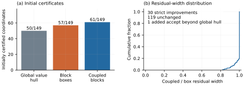

*Figure 4. The full initial ablation retains unchanged widths and refused
coordinates. The global-hull baseline explains most added accepts. Raw inputs,
intervals, refinement stages, setup, and actual rational fallback costs are
in [`coupling.json`](../results/certification/coupling.json).*

Independent high-precision comparisons use 110 decimal digits and an explicit
scaled $10^{-95}$ tolerance for numerical comparison with exact zero-width
intervals. The first zero-tolerance development attempt failed on cancellation
in a constant channel; that methodological failure is documented. Certificate
and rational-oracle comparisons use exact fractions without this tolerance.
Stored decimal endpoints are displays rather than reusable certificate data.
Broad channels and exact midpoint abstentions remain in the artifact.

## 9. Why the bound succeeds or fails

### 9.1 Local uncertainty and selective refinement

A numerical CPU experiment uses $N=8192,d=16,h=8,B=16,Q=24$ and one BLAS thread.
The generator supplies favorable four-coordinate structure. With tight blocks,
the metadata-only screen passes all 24 queries. Introducing one broad block
causes every initial query to fail; correcting that block evaluates the attention
weights and values of exactly $1/16$ of the tokens. Making all blocks broad
requires correction of every token. The correction-token counter excludes the
current Python executor's full-source input validation and fingerprint passes,
which read K/V even when no correction is needed. Its actual CPU timing includes
those passes, so this counter is not a total memory-traffic measurement. The
experiment identifies uncertainty localization rather than GPU speedup. The
complete Python paths are slower than dense NumPy, with construction and actual
fallback costs retained.

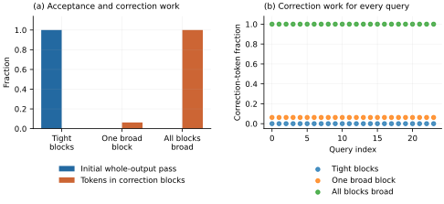

*Figure 5. One uncertain block permits local correction; diffuse uncertainty
removes that advantage. Every query's correction-token fraction is shown. Full-source validation reads
are additional and included in the reported CPU times.*

The GPU synthetic controls keep $d=h=64$ and use BF16 input values represented
exactly in binary64 for the summary path. Tight clusters can pass fully.
Aggregating seeded inputs reused across ranks, moderate cases pass 10,197 of 19,008 coordinates across configurations but none
of 297 complete outputs. In the centered-value control, 1,986 of 2,048
coordinates pass while only 6 of 32 outputs do. An output is a conjunction of
coordinate decisions; high marginal coordinate coverage is therefore a weak
predictor of complete-output usefulness. Independence between coordinates is
neither assumed nor needed for this observation. Exact-midpoint controls reject
all strict cells by design.

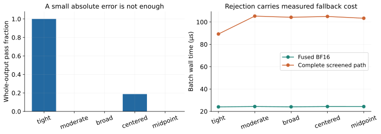

*Figure 6. These rank-four, $N=8192,Q=32$ controls change the source of
uncertainty and the output's cell margins. One failed coordinate triggers the
measured full-batch fallback.*

### 9.2 Trained post-RoPE activations

We capture actual Q/K/V arguments at the attention call of the public
Qwen2.5-0.5B model [13], pinned to revision
`060db6499f32faf8b98477b0a26969ef7d8b9987`, using Transformers 4.51.3 and BF16
weights. The arrays are captured after RoPE. Three deterministic original probe
texts cover descriptive prose, code, and arithmetic at prefix lengths 1,024 and
4,096. The final prefill query sees the full supplied prefix, with contiguous
GQA groups of seven query heads per KV head. Scaling by $1/8$ is exact for the
captured values. This setup is an activation diagnostic, not a language-model
accuracy benchmark or a sample of production traffic.

All 24 layers and 14 query heads are checked at retained rank eight: six
prefixes times 336 heads gives 2,016 head instances and 129,024 coordinates.
We additionally check full rank in layers 0, 12 and 23, giving 252 head instances.
Both sets produce zero numerical coordinate or whole-output passes. Retained
coordinates are a prefix of the actual transformed basis. No learned basis,
PCA fitting, or clustering was performed, so this result does not rule out other
representations.

| Radius diagnostic | Rank 8 | Rank 64, representative layers |
| --- | ---: | ---: |
| Median maximum-block retained bound $\rho$ | 1.32 | 29.91 |
| Median maximum-block discarded bound $\epsilon$ | 34.24 | 0 |
| Median actual maximum projected score deviation | 0.85 | 8.91 |
| Median minimum-channel BF16 boundary margin | $8.95\cdot10^{-7}$ | $6.66\cdot10^{-7}$ |

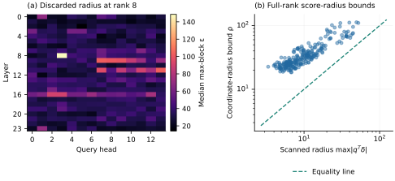

*Figure 7. Low rank leaves substantial discarded-score variation. At full rank,
coordinate bounds are looser than scan-derived radii, and the actual score
variation is still substantial. Computing the diagnostic radii reads tokens;
it is not free query metadata.*

The failure has two levels. At rank eight, $e^\epsilon-1$ amplifies the
centered-value perturbation far beyond the cell margin. At full rank that term
vanishes, but $\kappa(\rho)$ becomes large because the retained score radius is
broad. The median maximum absolute candidate error is about 0.82 at rank eight
and 0.50 in the full-rank subset. Even a tighter scalar bound would have to
resolve every coordinate within much narrower cells. Figure 8 normalizes the
omitted quadratic, Taylor, and projection terms by the actual shifted mass to
make their scale interpretable in output units.

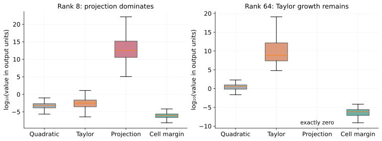

*Figure 8. Box plots retain the distribution of the maximum-channel centered
numerator terms divided by true shifted mass, alongside minimum-channel cell
margins. The terms are explanatory diagnostics, not an exact additive
decomposition of output error; mass uncertainty also contributes. Outliers are
retained in the JSON even when excluded from the plot's whiskers.*

A smaller rank reduces the stored rank-dependent arrays; useful certification
also requires controlled discarded-score uncertainty. Increasing rank can replace projection inflation with Taylor
inflation. This explains the unfavorable trace result more precisely than a
single zero-coverage number. A useful next representation must address actual
within-block score variation, the looseness of query-independent radius bounds,
and value dependence together.

## 10. What the GH200 measurements establish

### 10.1 Matched execution and retained costs

The machine has one NVIDIA GH200 GPU, compute capability 9.0, 97,871 MiB reported
GPU memory, driver 580.105.08, CUDA 12.8, and PyTorch 2.7.0. The final sweep
contains 57 synthetic configurations and nine actual prose trace/rank
configurations. It varies $N\in\{1024,8192,32768\}$, rank, key spread, and
$Q\in\{1,32\}$. The latter is a noncausal batch of queries sharing K/V, not
32 independent serving requests. Actual trace cases use seven query heads
sharing one KV head at the final prefix position.

The baseline explicitly forces PyTorch's fused FlashAttention SDPA backend,
with the same BF16 input values, scale, visible keys, and no dropout. A separate
binary64 softmax/matmul path checks numerical outputs. Resident query timings
exclude setup by definition; setup, uploads, casts, allocations, workspace,
and graph capture are recorded separately. Complete eager-path timings include
screening, device reduction of decisions, CPU synchronization, and either an
output cast or a full-batch dense fallback. Seven samples of 20 invocations
supply raw CUDA-event and host-wall measurements. Plotted quantiles describe
these timing samples, not a confidence interval for other workloads.

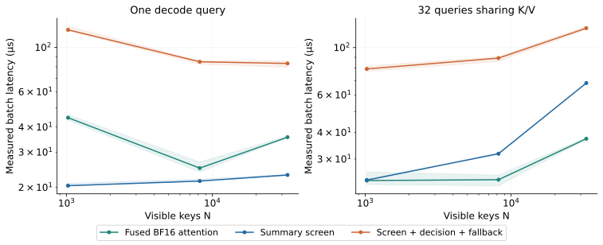

*Figure 9. Wall-clock medians with 10th–90th sample quantiles for tight rank-four
inputs. The complete path includes its actual decision and fallback behavior.*

### 10.2 A bottleneck explanation, with an adverse case

| Tight rank-four case | Original graph | Shared-scalar graph | Parallel-reduction graph | Dense graph |
| --- | ---: | ---: | ---: | ---: |
| $N=1024,Q=32$ | 20.47 µs | 19.87 µs | 20.84 µs | 9.80 µs |
| $N=8192,Q=1$ | 35.69 µs | 35.60 µs | 18.72 µs | 14.55 µs |
| $N=32768,Q=1$ | 118.65 µs | 118.14 µs | 20.09 µs | 31.30 µs |
| $N=32768,Q=32$ | 143.28 µs | 147.52 µs | 64.89 µs | 34.21 µs |

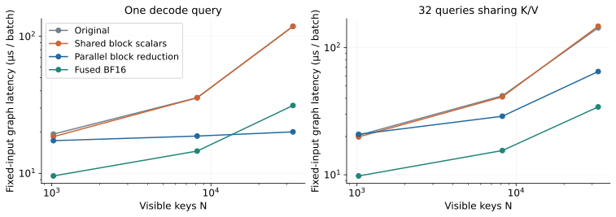

*Figure 10. Sharing repeated scalar arithmetic barely changes the dominant
serial block reduction. Exposing that block work across CTAs changes the
long-context single-query case. Additional synchronization hurts at small N.*

The original reduction runs one thread per output coordinate, each looping
serially over blocks. A single query with 64 output coordinates exposes very
little parallelism. A CTA per coordinate makes block parallelism available;
for the favorable $N=32768,Q=1$ case, the isolated reduction phase falls from
99.38 to 6.65 microseconds. In contrast, 32 queries already expose more work,
and the additional per-coordinate CTAs and synchronization can cost more than
they save for small block counts. This is an architectural explanation tested
by an implementation ablation, rather than a speedup predicted from arithmetic.

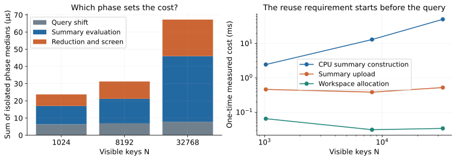

*Figure 11. Isolated phase medians diagnose the bottleneck; their sum is not used
as a substitute for measured complete latency. CPU construction, upload, and
workspace allocation remain explicit.*

### 10.3 Why the favorable kernel result is insufficient

For $N=32768,Q=1,r=4$, the resident parallel screen takes 20.09 microseconds under
fixed-input graph replay versus dense attention's 31.30 microseconds. The actual
complete eager path instead takes 83.11 microseconds against 35.62 microseconds,
with about 51.50 milliseconds of reusable summary and workspace setup. Its CPU
moment-and-extrema array payload is 1,000,448 bytes, the uploaded box summary 869,376 bytes, and
original BF16 K/V 8,388,608 bytes. This excludes 262,144 bytes of group indices and Python object/hash overhead.
Scratch and original K/V retention are reported separately. The resident kernel advantage does not establish that the
complete path saves time or memory in a serving system.

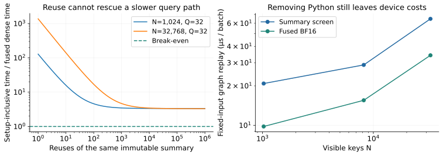

*Figure 12. The complete query path is slower than dense in every measured
configuration, so no finite reuse count repays setup under those measured costs.
Fixed-input graph replay identifies remaining device work and omits the adaptive
host decision; it is a separate experiment.*

Across 66 final configurations, numerical accepted coordinates have no observed
BF16 mismatch against the binary64 attention check, but 1,691 mismatches against
the fused BF16 baseline. These aggregate counts include repeated configurations
and are not independent accuracy trials. They illustrate the distinct targets:
a real-attention rounding cell does not specify a fused kernel's intermediate
precision or accumulation. The binary64 comparison itself remains numerical,
not an exact-real proof of each GPU decision.

The first trained-trace parity attempt also failed an absolute residual
tolerance because broad bounds have extremely large magnitudes. The repaired
comparison uses a $10^{-12}$ scaled tolerance and still requires identical
screen decisions plus independent output checks. Maximum observed scaled
variant difference is $1.33\cdot10^{-15}$. The initial nine failures and the
original scalar-only sweep are retained. This tolerance is for implementation
parity diagnostics; it is not added to a sound interval claim.

### 10.4 Reproduction at the committed implementation

The figures and tables retain the first complete sweep. A second run on the
same GH200 measures commit `d2c3668`, including the final host ABI guards and
formatted sources. Source, library, and trace hashes are recorded in
[`provenance.json`](../results/gh200/provenance.json); the original measurement
is preserved alongside [`reproduction.json`](../results/gh200/reproduction.json).
All 66 cases pass again, with unchanged coverage and mismatch counts. Across
cases, parallel-screen graph medians differ by between −1.08% and +1.42%, with
a median ratio of 1.002. Complete-path and dense host-wall medians are noisier:
their median ratios are 1.075 and 1.112, respectively. Every complete screened
path remains slower than dense, and no finite setup break-even appears. This
checks repeatability on this machine; it does not estimate variation across
devices, model families, or serving systems.

## 11. Relation to primary literature

The relevant mathematical ingredients have established histories. Adaptive
predicates decide a sign with a cheap filter and increase effort only when
uncertainty remains [5]. Taylor models retain polynomial structure with a
bounded remainder [9]. Our box extrema are elementary support functions of
rectangles, and the coupled optimizer is elementary polyhedral optimization.
The paper does not claim those principles as new.

In attention, Multipole Attention already clusters keys, performs selected
exact work, and retains approximate contributions elsewhere [2]. TaylorShift
rearranges polynomial attention, and symmetry-aware Taylor features exploit
polynomial tensor structure [3,4]. COBS uses compressed covariance statistics
to estimate block mass; SPLA combines second-order selection with a residual
linear path [11,12]. LOCKS also explicitly analyzes the limits of moment-only
page summaries for broad or peaky scores [10]. The score-spread diagnosis here
is consistent with that concern, while this paper measures its effect on strict
output-cell certification. We have not reproduced those systems or claimed a
performance advantage over them.

WitCert and attention-memory observability contracts already connect runtime
witnesses, formal scope, and local fallback [6,7]. The distinction studied here
is the residual interface for a specified consumer, the projected signed
value moments supplying its inputs, and the stronger block mass/value coupling.
The present 64-theorem development and GH200 experiments make that combination
checkable and expose where it fails. They do not establish publication priority
or a universally useful sublinear attention algorithm. The dated
[primary-literature comparison](../docs/NOVELTY.md) records specific overlap.

FlashAttention reorganizes dense computation around GPU memory traffic [1],
and subsequent Hopper work exploits asynchronous execution [14]. Dense decode
also admits sequence-parallel strategies [15]. Our forced PyTorch fused backend
is a concrete comparison point; it is not an assertion that every newer or
decode-specialized implementation has been exhausted. Consequently, the
positive device-stage result has deliberately narrower scope than a claim of
state-of-the-art attention performance.

## 12. Consequences and next research decisions

The measurements support a specific research direction. Better summaries must
preserve information that controls the consumer decision, not only approximate
attention mass. Value-range coupling demonstrates one such improvement. The
trained traces separately expose large score uncertainty; coupled certification
on those traces remains unmeasured.
Block partitioning, score-radius witnesses, higher-order residuals, and
consumer-specific margins are therefore separate design variables to test.
Any query-dependent tightening that scans keys must account for that scan.

The GPU study identifies a separate implementation requirement. A resident
parallel reduction can make the screening stage competitive in one regime,
but removing the host decision and bounding fallback work are prerequisites for
turning that result into a useful path. A sound GPU summary builder remains
another prerequisite for claiming a rigorous accelerated executor. The present
artifacts establish the real-arithmetic certificate, test a rational
implementation, and measure numerical GPU behavior with those distinctions
preserved.

## References

[1] T. Dao et al. *FlashAttention: Fast and Memory-Efficient Exact Attention with
IO-Awareness*. 2022. [arXiv:2205.14135](https://arxiv.org/abs/2205.14135)

[2] C. Hooper et al. *Multipole Attention for Efficient Long Context Reasoning*.
2025. [arXiv:2506.13059](https://arxiv.org/abs/2506.13059)

[3] T. C. Nauen, S. Palacio, and A. Dengel. *TaylorShift: Shifting the Complexity
of Self-Attention from Squared to Linear (and Back) using Taylor-Softmax*.
2024. [arXiv:2403.02920](https://arxiv.org/abs/2403.02920)

[4] F. A. Heinsen and L. Kozachkov. *Self-Attention at Constant Cost per Token via
Symmetry-Aware Taylor Approximation*. 2026. [arXiv:2602.00294](https://arxiv.org/abs/2602.00294)

[5] J. R. Shewchuk. *Adaptive Precision Floating-Point Arithmetic and Fast Robust
Geometric Predicates*. Discrete & Computational Geometry 18, 305-363, 1997.
[Author's page](https://www.cs.cmu.edu/~quake/robust.html)

[6] F. Wei et al. *WitCert: Sound Runtime Risk Observability and Gating for
KV-Cache Quantization*. 2026. [arXiv:2607.28699](https://arxiv.org/abs/2607.28699)

[7] F. Wei et al. *Runtime Observability for Heterogeneous Attention Memory*.
2026. [arXiv:2608.05863](https://arxiv.org/abs/2608.05863)

[8] Y. Kang, G. Tran, and H. De Sterck. *Fast Multipole Attention: A Scalable
Multilevel Attention Mechanism for Text and Images*.
2023. [arXiv:2310.11960](https://arxiv.org/abs/2310.11960)

[9] M. Berz and G. Hoffstätter. *Computation and Application of Taylor Polynomials
with Interval Remainder Bounds*. Reliable Computing 4, 83-97, 1998.
[doi:10.1023/A:1009958918582](https://doi.org/10.1023/A:1009958918582)

[10] J. Hwang. *Locks: Page-Local Compact Key Summaries for Efficient Long-Context
Decoding*. 2026. [arXiv:2607.24555](https://arxiv.org/abs/2607.24555)

[11] A. Tian et al. *COBS: Cumulant Order Block Sparse Attention*.
2026. [arXiv:2607.09052](https://arxiv.org/abs/2607.09052)

[12] B. Wang et al. *SPLA: Block Sparse Plus Linear Attention for Long Context
Modeling*. 2026. [arXiv:2601.22379](https://arxiv.org/abs/2601.22379)

[13] Qwen Team. *Qwen2.5-0.5B model card and public weights*.
[Pinned checkpoint](https://huggingface.co/Qwen/Qwen2.5-0.5B/tree/060db6499f32faf8b98477b0a26969ef7d8b9987).

[14] J. Shah et al. *FlashAttention-3: Fast and Accurate Attention with
Asynchrony and Low-precision*. 2024. [arXiv:2407.08608](https://arxiv.org/abs/2407.08608)

[15] R. Sanovar et al. *Lean Attention: Hardware-Aware Scalable Attention
Mechanism for the Decode-Phase of Transformers*. 2024.
[arXiv:2405.10480](https://arxiv.org/abs/2405.10480)
